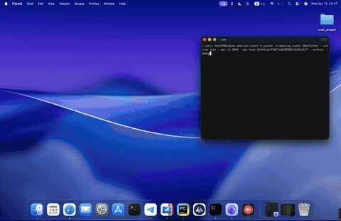

# tgwebview

> Native desktop WebView for Telegram Mini Apps with full SDK bridge. Opens any Mini App in a real browser window (WebKit / Chromium / WebKitGTK) with complete Telegram SDK emulation — CloudStorage, write access, and session keep-alive go through real MTProto, not local stubs.

[](#install)
[](LICENSE)
[](#how-it-works)



## Features

- **Full SDK bridge** — every Mini App SDK event is handled natively
- **Real MTProto** — CloudStorage, write_access, prolongWebView via Telegram API
- **Multi-library** — Telethon, Pyrogram, Kurigram (auto-detected from client type)
- **Platform emulation** — tdesktop, android, ios (user-agent + platform identifier)
- **Event handlers** — intercept QR scanner, clipboard, biometry, location, sensors
- **JS injection** — custom JavaScript at document-start or runtime
- **Page dump** — extract HTML, cookies, localStorage, sessionStorage
- **Cross-platform** — macOS (WebKit), Windows (Edge/Chromium), Linux (WebKitGTK)

## Install

```bash
pip install git+https://github.com/maryny4/tgwebview.git

# Pick your Telegram library
pip install telethon        # recommended
pip install kurigram        # pyrogram fork, up-to-date TL layer
```

## Quick Start

```python
from telethon import TelegramClient
from webview_runner import WebApp

app = WebApp(
    "@botname",
    client=TelegramClient("my_session", api_id=12345, api_hash="abc123"),
)
app.run()
```

With Pyrogram / Kurigram:

```python
from pyrogram import Client
from webview_runner import WebApp

app = WebApp(
    "@botname",
    client=Client("my_session", api_id=12345, api_hash="abc123"),
)
app.run()
```

## Parameters

```python
app = WebApp(
    "@botname",
    client=client,              # Telethon / Pyrogram / Kurigram (unstarted)
    platform="android",         # "tdesktop" | "android" | "ios"
    mode="fullsize",            # "compact" | "fullsize" | "fullscreen"
    launch="auto",              # "auto" | "main" | "menu"
    theme_params=THEME_DARK,    # THEME_LIGHT (default) or THEME_DARK
    width=400,                  # window width
    height=800,                 # window height
    user_agent="Custom/1.0",    # override User-Agent
    inject_js="...",            # JS injected at document-start
    verbose=True,               # forward JS console to Python logging
    debug=True,                 # enable WebView inspector
)
```

## Launch Modes

| Mode | Description |
|------|-------------|
| `auto` | Try Main Mini App first, fall back to menu button (default) |
| `main` | RequestMainWebView only (e.g. `@hamster_kombat_bot`) |
| `menu` | RequestWebView via menu button only (e.g. `@dekstop_tmabot`) |

## Event Handlers

Intercept SDK events with async handlers:

```python
@app.on("qr_scan")
async def handle_qr(data):
    return "https://example.com/scanned"

@app.on("clipboard")
async def handle_clipboard(data):
    return "clipboard content here"

@app.on("biometry")
async def handle_bio(data):
    if data.get("action") == "request_auth":
        return {"token": "my_bio_token"}
    return {"available": True, "type": "fingerprint",
            "access_requested": True, "access_granted": True}

@app.on("location")
async def handle_location(data):
    if data.get("action") == "check":
        return {"available": True}
    return {"latitude": 55.7558, "longitude": 37.6173}
```

## Automation

Execute JS on the loaded page and interact with the Mini App:

```python
@app.on_ready
async def automate():
    await app.js("document.querySelector('.start-btn').click()")

    title = await app.js("document.title")

    await app.js("document.getElementById('search').value = 'hello'")

    await asyncio.sleep(2)
    await app.js("document.querySelector('.submit').click()")
```

## JS Injection

Inject JavaScript before the page loads — intercept requests, override APIs:

```python
app = WebApp(
    "@botname",
    client=client,
    inject_js="""
    const _fetch = window.fetch;
    window.fetch = async (url, opts) => {
        console.log('[HOOK]', url);
        return _fetch(url, opts);
    };

    Object.defineProperty(navigator, 'platform', {get: () => 'Linux armv8l'});
    """
)
```

## Page Dump

Extract page data from `@app.on_ready` or any event handler:

```python
@app.on_ready
async def dump():
    html = await app.dump_html()
    cookies = await app.dump_cookies()
    local_storage = await app.dump_local_storage()
    session_storage = await app.dump_session_storage()
```

## CLI

```bash
tgwebview @botname \
    --session my_session \
    --api-id 12345 \
    --api-hash abc123 \
    --platform android \
    --dark \
    --verbose
```

## How It Works

```
Python                          WebView (native)
  │                                │
  ├── MTProto client ◄────────────┤ TelegramWebviewProxy.postEvent()
  │     ├── resolve URL            │     ├── CloudStorage ──► invokeWebViewCustomMethod
  │     ├── prolongWebView (60s)   │     ├── write_access ──► canSendMessage
  │     └── disconnect on close    │     └── SDK events ───► Python handlers
  │                                │
  └── pywebview JS API ◄──────────┘ bridge messages (__TG_*__)
```

1. **Connect** — MTProto client on internal event loop, authenticates
2. **Resolve** — `RequestMainWebView` or `RequestWebView` → Mini App URL
3. **Inject** — `WKUserScript` / `CoreWebView2` / `WebKit2.UserScript` at document-start
4. **Bridge** — SDK calls route through pywebview JS API to Python
5. **MTProto** — CloudStorage → `invokeWebViewCustomMethod`, keep-alive → `prolongWebView`
6. **Cleanup** — window close: cancel timer, disconnect client, stop loop

## MTProto Features

These work automatically when a client is provided:

| Feature | MTProto Call |
|---------|-------------|
| CloudStorage | `bots.invokeWebViewCustomMethod` |
| Write Access | `bots.canSendMessage` + `bots.allowSendMessage` |
| Session Keep-Alive | `messages.prolongWebView` (60s) |
| URL Resolution | `RequestMainWebView` / `RequestWebView` |

## Supported Libraries

| Library | Status | Notes |
|---------|--------|-------|
| [Telethon](https://github.com/LonamiWebs/Telethon) | Full support | Recommended |
| [Kurigram](https://github.com/KurimuzonAkuma/kurigram) | Full support | Fork of pyrogram |
| [Pyrogram](https://github.com/pyrogram/pyrogram) | Works on 3.11 | Abandoned, outdated TL layer (v6.7) |

## Project Structure

```
webview_runner/
├── __init__.py          # Public API: WebApp, THEME_LIGHT, THEME_DARK
├── __main__.py          # CLI entry point
├── app.py               # WebApp controller
├── bridge.py            # JS→Python message routing
├── defaults.py          # Built-in handlers: QR, clipboard, biometry
├── injectors.py         # Platform-specific JS injection (WebKit / Edge / GTK)
├── inject.js            # TelegramWebviewProxy SDK bridge (document-start)
├── qr_camera.js         # In-WebView camera QR scanner (jsQR / BarcodeDetector)
├── constants.py         # Platform configs, theme palettes
└── adapters/
    ├── __init__.py      # MTProtoAdapter ABC + auto-detection
    ├── _telethon.py     # Telethon adapter
    └── _pyrogram.py     # Pyrogram / Kurigram adapter
```

## License

MIT
